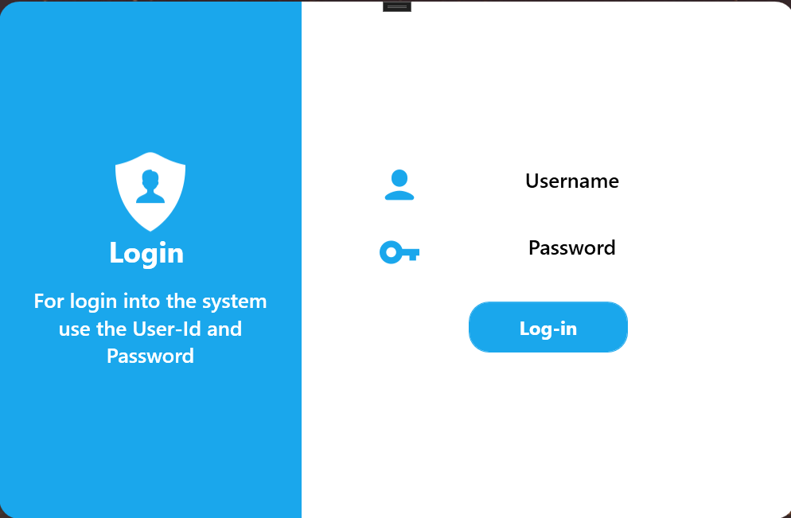
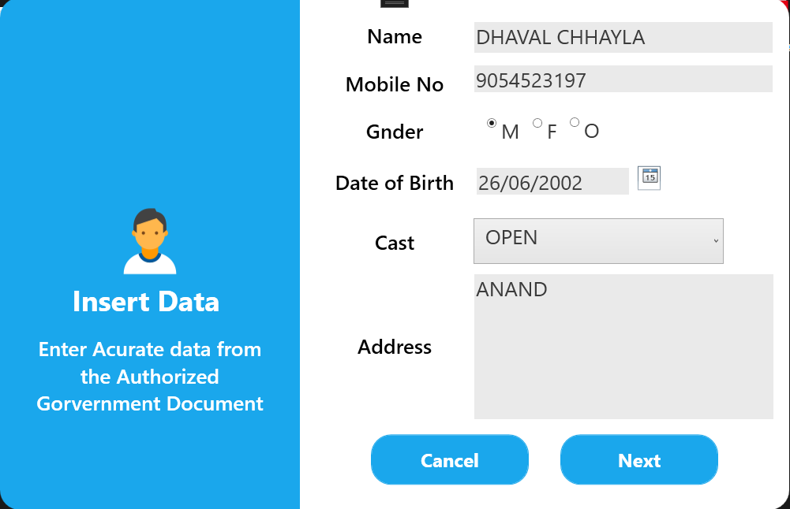
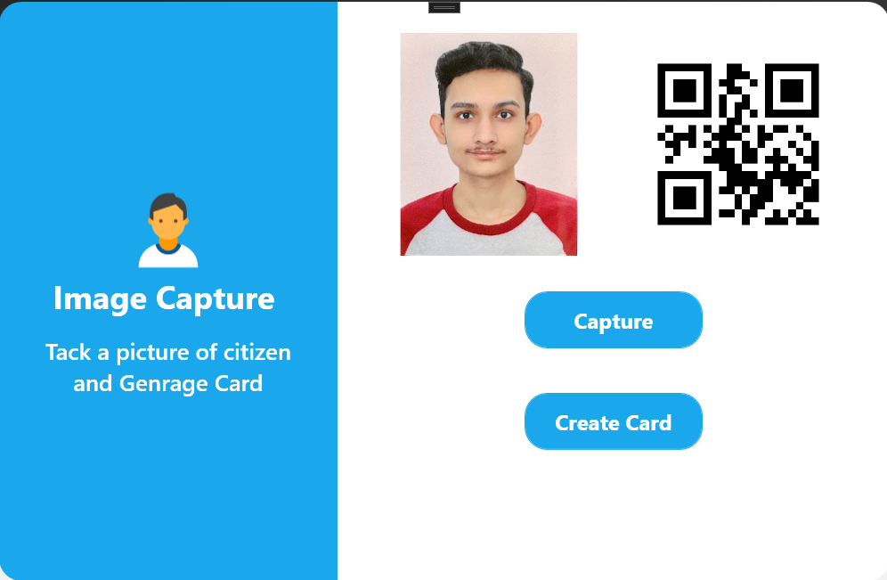
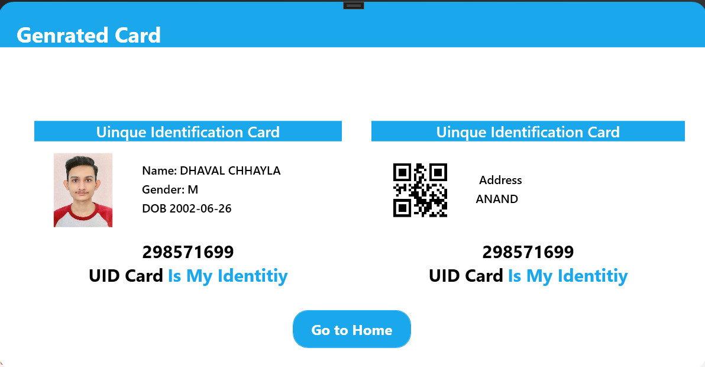

# Virtual-ID
<b> This system's main task is to get the data 
of the citizen, store it in a database, and generate a UID card that 
contains the data of the user with a QR code.</b>

<b>Technology used : </b> 
* .Net framework
* Windows Presentation Foundation (WPF)

<b> IDE : </b> 
* Visual Studio  

<b> Database : </b>
* MySQL

#### App Snapshots

<table>
  <tr>
    <td>Login Screen</td>
    
  </tr>
  <tr>
    <td></td>
    
  </tr>

   <tr>
 <td>Insert Data Screen</td>  </tr>
  <tr>
   <td></td>
  </tr>

   <tr>
    <td>Image Capture Screen</td>
    
  </tr>
  <tr>
    <td></td>
    
  </tr>

   <tr>
    <td>Card Screen</td>
    
  </tr>
  <tr>
    <td></td>
    
  </tr>
 </table>
